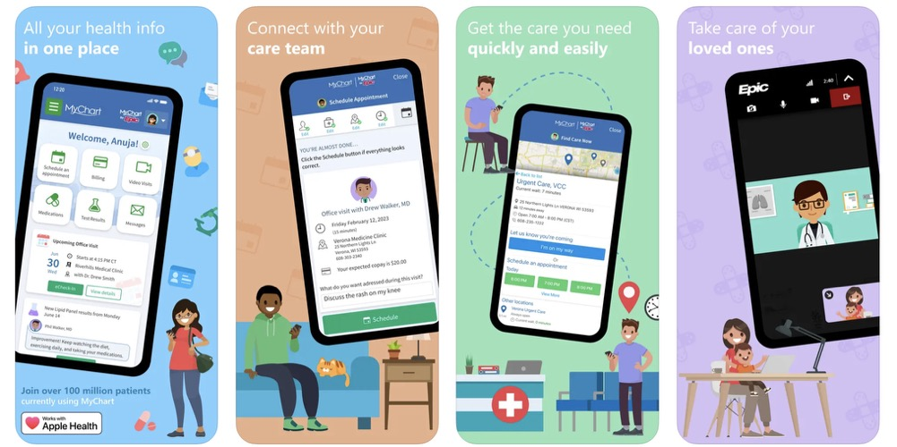
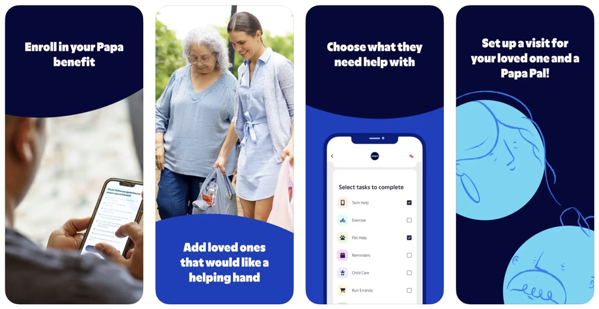
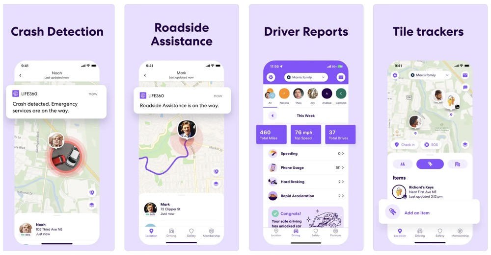

# 🧓 Apps for Elderly Care and Monitoring

## Summary

(1) MyChart & (2) Papa  
These two apps are designed for direct use by elderly individuals themselves.  
	MyChart empowers seniors to manage their own medical records, communicate with doctors, and schedule appointments.  
	Papa provides in-person companionship and daily support through vetted young helpers, relieving loneliness and improving daily life quality.

(3) Life360  
	This app targets family members (especially adult children) who want to monitor and protect elderly parents from a distance.  
	It enables real-time location sharing, safety alerts, and history tracking — creating a “digital family safety net.”

## 🩺 Health Management: MyChart

- **Developer:** Epic Systems Corporation  
- **Platform:** iOS / Android / Web  
- **Target Users:** General patients, especially seniors with chronic conditions
- **Core Concept:** 
    “Empowering patients with control over their medical data”  
	•Users can access medical records, communicate with doctors, schedule appointments, and view test results directly through the app.  
	•Encourages proactive health management for aging populations.

---

## 👥 Social Companionship (In-person support): Papa

- **Developer:** Papa Inc.  
- **Platform:** iOS / Android / Web  
- **Target Users:** Elderly individuals in need of companionship  
- **Core Concept:** 

  •Combines in-person visits and remote support to reduce loneliness among seniors.  
	•Offers emotional connection and daily assistance — more than just a tech product.

---

## 🛡️ Safety Monitoring & Remote Care: Life360

- **Developer:** Life360 Inc.  
- **Platform:** iOS / Android / Web  
- **Target Users:** Families (parents, children, elderly members); ideal for monitoring seniors remotely  
- **Core Concept:** 

    •Builds a digital “family circle” for safety and communication.  
	•Features include live location sharing, emergency alerts, and history tracking — ideal for long-distance elderly care.

